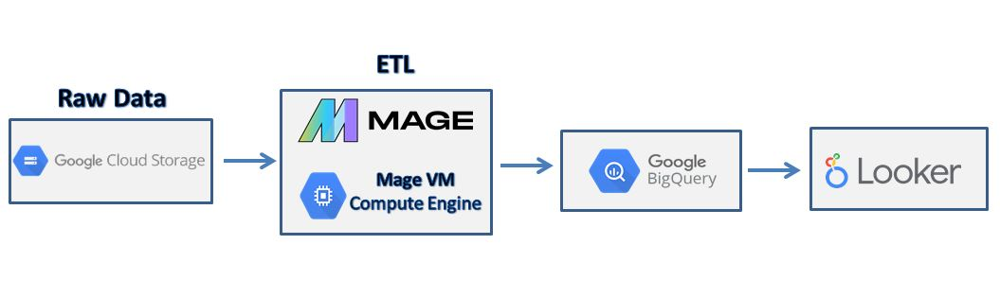
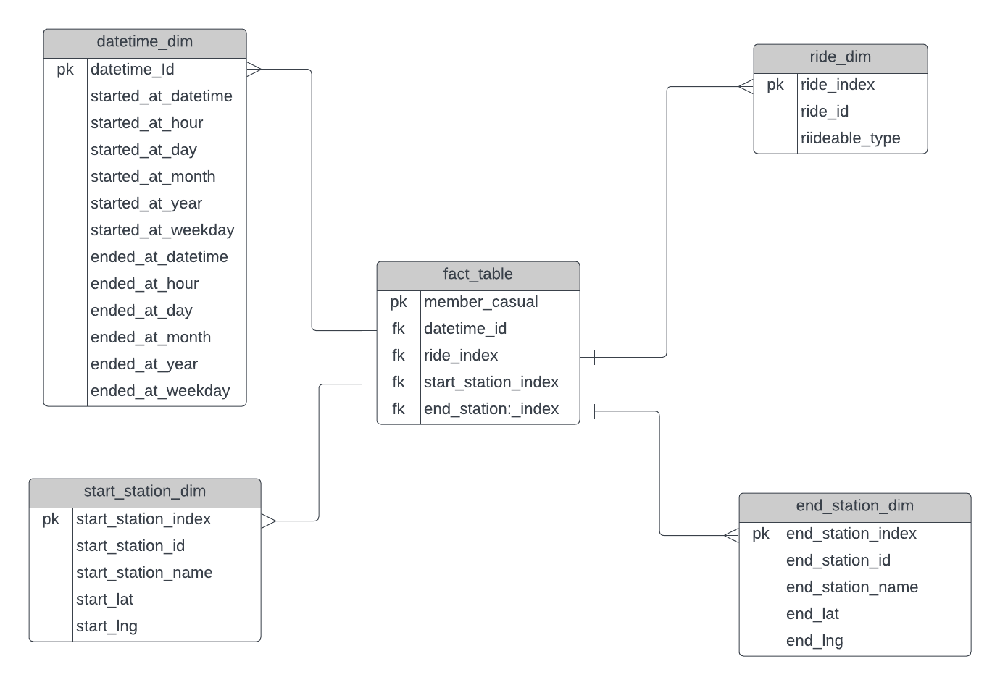

Introduction

The goal of this project is to perform data analytics on Cyclistic data using various tools and technologies, including GCP Storage, Python, Compute Instance, Mage Data Pipeline Tool, BigQuery, and Looker Studio. 

Architecture

Dataset Used

I used sample of Chicago Bicycle Rent Usage data from Kaggle link https://www.kaggle.com/datasets/gunnarn/chicago-bicycle-rent-usage?select=202102-divvy-tripdata.csv Only sample of data is used becuase in this project the accent was not on deep analysis but on using and learning technologies as Google Storage, Compute Instance, Mage AI, BigQuery and Looker Studio.

Data model (star schema created from flat file)

Steps in project: 

- First write code in jupyter notebook with transforming flat file to star schema that you will later use for queries. You can use free app lucid ( https://lucid.app/documents#/documents?folder_id=recent ) to create charts 

- Create Google Cloud account. Start new project and create new bucker for storing your csv file with data. After you uplaod data allow public access (permissions option than change to fine-grained and after that edit access to public) so later you can approach it from other apps. Than you should create new VM instance. Chose your configuration (4 vCPU, 16Gb memory is enough for this project) and allow HTTP and HTTPS traffic on instance. After you open VM terminal of your new instance run all commands from file Commands for Mage VM.txt in repository. Last message you will get is that Mage is running on port 6789. Now you need to configure your firewall configuration (add new firewall rule) and allow access on port 6789 for TCP protocol (for source IPv4 Ranges you can use 0.0.0.0/0 or your private IP address). After that you can access Mage API using external IP address provided to your VM instance after allowing public access and port 6789.

- Mage AI is tool used to automate your workflow with pipeline for transforming and integrating data. Read official documentation and use Data Loader,Transformer and Data Exporter blocks to load, transform and export data from Mage AI to Big Query (all codes provided in repository). To use Data Exporter block and connect Mage Ai to Big Query you need to download keys from Google Cloud (APIs & Services)and change yaml configuration file in Mage AI (change parts related to Google Services).

- After you load your data to Big Query you can analyse data with SQL queries. At the end create table tbl.analytics (code provided in repository file analytics_query.sql) that you can later connect to Locker for analysis. 

- Use free tool for visualisation Looker Studio(https://lookerstudio.google.com/u/0/navigation/reporting). Go to new blank report than choose BigQuery option and in shared projects option chose your current working projet than dataset and at the end tbl_analytics that you will analyse. Create your own custom template and charts. 